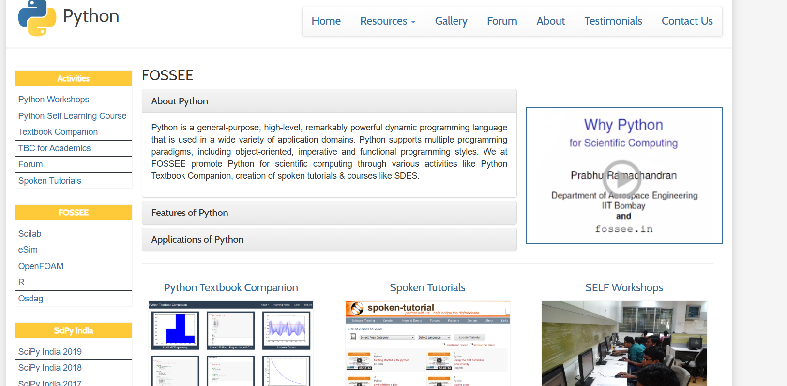
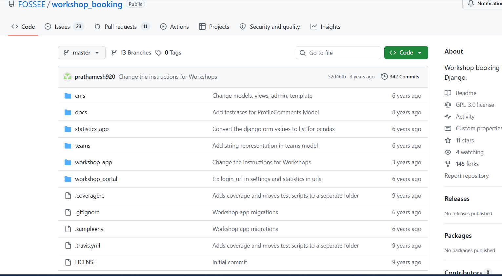
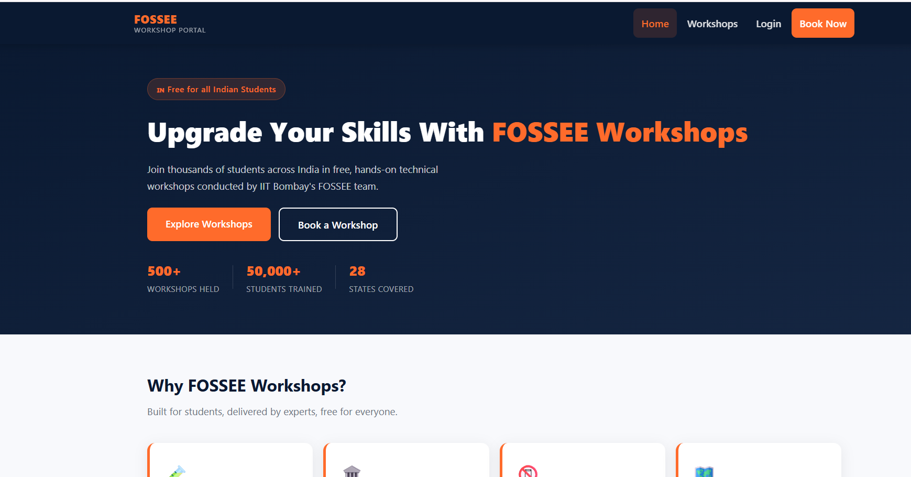
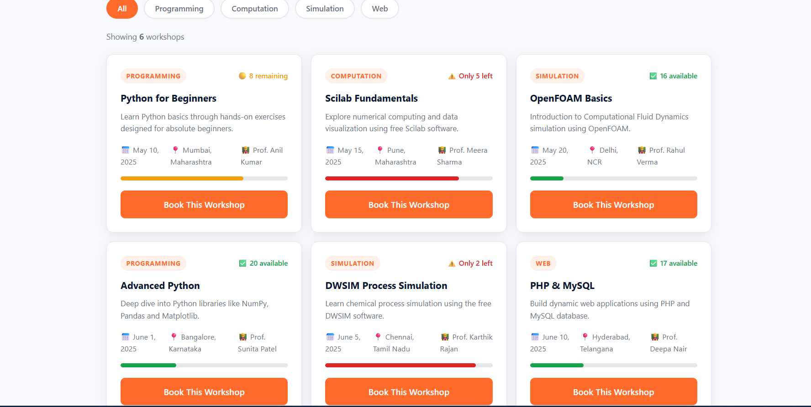
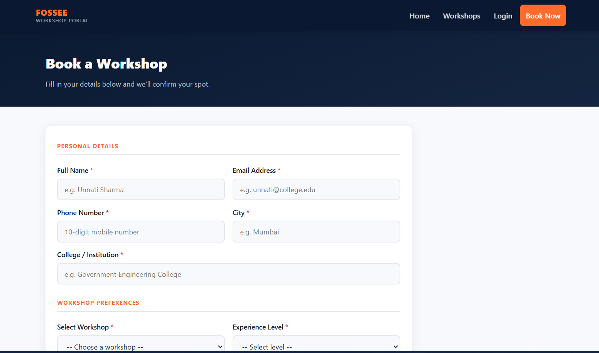
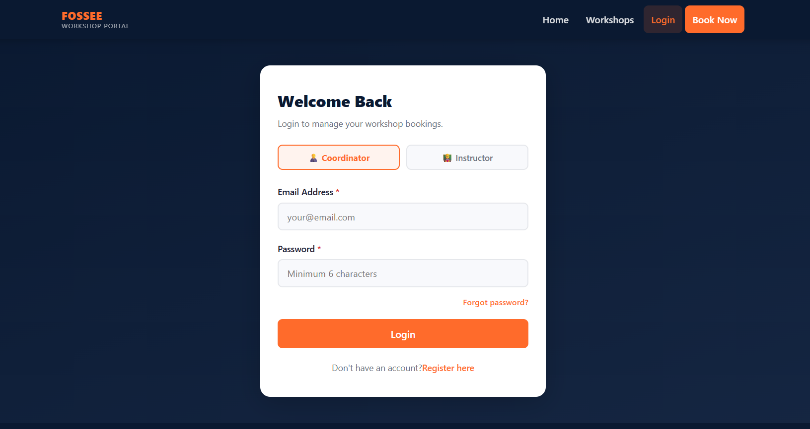
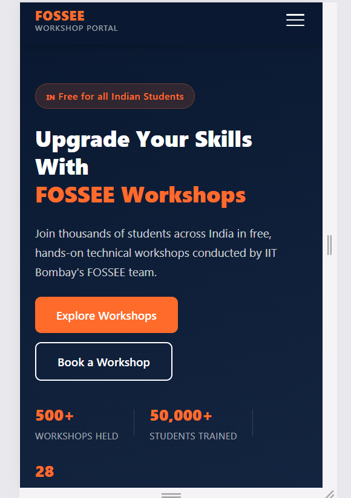
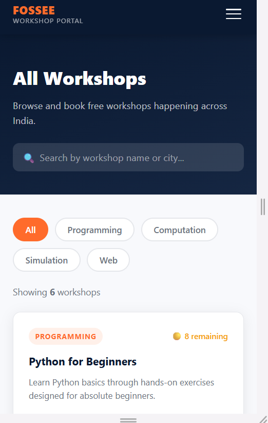

# FOSSEE Workshop Portal — UI/UX Redesign

A complete mobile-first redesign of the FOSSEE Workshop Booking portal using React.
Original repository: [FOSSEE/workshop_booking](https://github.com/FOSSEE/workshop_booking)

---

## 🚀 Live Setup Instructions

### Prerequisites
- Node.js (v16 or above)
- npm

### Steps to run locally

```bash
git clone https://github.com/unnatilohana2610-cell/fossee-workshop-redesign.git
cd fossee-workshop-redesign
npm install
npm start
```

Open [http://localhost:3000](http://localhost:3000) in your browser.

---

## 🎥 Demo Video
[Click here to watch project walkthrough](https://github.com/unnatilohana2610-cell/fossee-workshop-redesign/blob/main/FOSSEE-Project_Unnati_explanation.webm)


---
## 📸 Before & After

### Before (Original FOSSEE Site)



### After (Redesigned)





### Mobile View



---

## 🎨 Design Principles

### 1. Mobile-First Approach
Since the primary users are students accessing the portal on mobile devices,
I designed every component starting from the smallest screen size and
scaled up to desktop. This meant single-column layouts on mobile that
expand to grids on larger screens.

### 2. Visual Hierarchy
I used size, color, and spacing deliberately to guide the user's eye.
The hero section immediately communicates the purpose of the site.
The saffron color draws attention to important actions like "Book Now"
while the navy background creates a calm, professional feel.

### 3. Accessibility First
Every interactive element has proper ARIA labels, roles, and keyboard
focus states. Form inputs have associated labels and error messages
use role="alert" so screen readers can announce them. Color contrast
ratios were kept high throughout.

### 4. Indian Identity
I chose saffron and navy as the primary colors — they feel connected
to IIT Bombay and India's educational identity while remaining
professional and modern.

### 5. Consistent Design Language
I defined all colors, spacing, fonts and shadows as CSS variables in
index.css so the entire site feels consistent and changes can be made
in one place.

---

## 📱 Responsiveness

I ensured responsiveness through:

- **Mobile-first CSS** — base styles target mobile, media queries add
  desktop layouts
- **CSS Grid with auto-fit** — workshop cards automatically reflow
  from 1 column on mobile to 3 columns on desktop
- **Flexible navigation** — hamburger menu on mobile, horizontal links
  on desktop with smooth animated toggle
- **Fluid typography** — font sizes and spacing adjust across breakpoints
- **Testing** — tested on Chrome DevTools with iPhone 12 Pro, iPad,
  and desktop viewport simulations

---

## ⚖️ Trade-offs

### Design vs Performance
- I chose CSS variables and pure CSS animations over heavy animation
  libraries to keep bundle size small
- Used system fonts (Segoe UI, sans-serif) instead of Google Fonts
  to avoid extra network requests
- Kept images minimal and used emoji icons instead of icon libraries
  where possible to reduce dependencies
- Used react-icons selectively rather than importing entire icon sets

### Completeness vs Time
- The statistics page from the original site was not redesigned as it
  required complex chart libraries which would have increased load time
  significantly
- Used static workshop data instead of API calls to keep the frontend
  focused on UI/UX demonstration

---

## 💪 Most Challenging Part

The most challenging part was designing the booking form to work well
on mobile. Forms on small screens can feel cramped and overwhelming.

My approach:
- Broke the form into clearly labelled sections (Personal Details,
  Workshop Preferences)
- Used full-width inputs on mobile that shift to 2-column grid on desktop
- Added real-time validation that clears errors as the user types,
  reducing frustration
- Designed a success screen that confirms the user's specific details
  back to them so they feel confident their booking was received

---

## 🛠️ Tech Stack

- React (JavaScript)
- React Router DOM — client side navigation
- CSS Variables — consistent theming
- Semantic HTML5 — accessibility and SEO
- Git — version control with progressive commits

---

## 📁 Project Structure
## 📁 Project Structure

    src/
    ├── components/
    │   ├── Navbar.js
    │   ├── Navbar.css
    │   ├── Footer.js
    │   └── Footer.css
    ├── pages/
    │   ├── Home.js
    │   ├── Home.css
    │   ├── WorkshopList.js
    │   ├── WorkshopList.css
    │   ├── BookWorkshop.js
    │   ├── BookWorkshop.css
    │   ├── Login.js
    │   └── Login.css
    ├── screenshots/
    ├── App.js
    ├── index.js
    └── index.css

    ---

## ✅ Submission Checklist

- [x] Code is readable and well-structured
- [x] Git history shows progressive commits
- [x] README includes reasoning and setup instructions
- [x] Screenshots included
- [x] Code is documented where necessary
- [x] Mobile-first responsive design
- [x] Accessibility with ARIA labels
- [x] SEO meta tags in index.html

---

*Redesigned by Unnati Lohana as part of FOSSEE Python Internship Screening Task.*